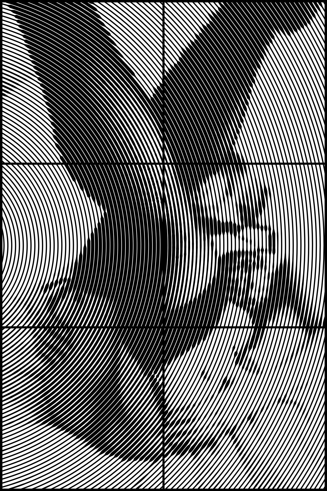

# Generador de Arte Circular
Generador de arte circular basado en imágenes en blanco y negro. Transforma una imagen en círculos concéntricos donde el grosor de cada línea varía según la intensidad de los píxeles, creando efectos visuales únicos.

Ejemplo de generación, imagen "Bodoir"




## Características

- ✨ **Conversión de imágenes** a arte circular concéntrico
- 📐 **Dimensiones precisas** para impresión 3D: 217.7mm × 217.7mm por panel (6 paneles)
- 🎨 **Control de contraste** y grosor de líneas
- 🔧 **Optimización automática** de puntos para archivos ligeros
- 📦 **División en paneles** (2×3 o 3×2 según orientación)
- 🖼️ **Marco automático** de 3.2mm
- ➗ **Líneas separadoras** de 2.8mm entre paneles
- 🎯 **Recorte preciso** mediante operaciones booleanas

## Instalación

### Requisitos

- Python 3.7 o superior
- pip (gestor de paquetes de Python)

### Pasos

1. **Clonar o descargar** este repositorio

2. **Instalar dependencias:**

```bash
pip install -r requirements.txt
```

Las dependencias necesarias son:
- `numpy` - Operaciones numéricas
- `Pillow` - Procesamiento de imágenes
- `shapely` - Operaciones geométricas y booleanas

## Uso

### Uso básico

```bash
python circular_lines_generator.py imagen.jpg -o salida.svg
```

Esto generará:
- `salida.svg` - Archivo completo con los 6 paneles
- `salida/` - Carpeta con 6 archivos SVG individuales (`panel_1.svg` a `panel_6.svg`)

### Parámetros

#### Obligatorio

- `imagen` - Ruta de la imagen de entrada (preferiblemente en blanco y negro)

#### Opcionales

| Parámetro | Descripción | Default | Ejemplo |
|-----------|-------------|---------|---------|
| `-o, --output` | Nombre del archivo SVG de salida | `salida.svg` | `-o mi_arte.svg` |
| `-n, --num-lineas` | Número de círculos concéntricos | `120` | `-n 500` |
| `-min, --grosor-min` | Grosor mínimo de línea (mm) | `6.0` | `-min 6` |
| `-max, --grosor-max` | Grosor máximo de línea (mm) | `16.0` | `-max 16` |
| `-c, --contraste` | Ajuste de contraste (50 = neutro) | `75.0` | `-c 50` |
| `-cx, --centro-x` | Posición X del centro (%) | `-20.0` | `-cx -20` |
| `-cy, --centro-y` | Posición Y del centro (%) | `50.0` | `-cy 50` |
| `--no-dividir` | Solo genera archivo completo, sin paneles individuales | - | `--no-dividir` |

### Ejemplos de uso

#### Ejemplo 1: Configuración personalizada

```bash
python circular_lines_generator.py foto.jpg -o arte.svg -n 500 -min 0.5 -max 5.0 -c 75
```

Genera 500 círculos con grosores entre 0.5 y 5.0mm, y contraste aumentado al 75%.

#### Ejemplo 2: Centro desplazado

```bash
python circular_lines_generator.py retrato.jpg -o retrato_circular.svg -cx -20 -cy 50
```

Crea círculos con el centro desplazado hacia la izquierda (fuera del canvas en x=-20%).

#### Ejemplo 3: Solo archivo completo

```bash
python circular_lines_generator.py paisaje.jpg -o completo.svg --no-dividir
```

Genera únicamente el archivo completo sin dividir en paneles individuales.

#### Ejemplo 4: Alta densidad de líneas

```bash
python circular_lines_generator.py detalle.jpg -n 1000 -min 0.1 -max 2.0
```

Crea 1000 círculos con líneas muy finas para capturar más detalle.

## Configuración de Dimensiones

El generador está optimizado para impresión 3D con estas dimensiones:

- **Tamaño por panel:** 217.7mm × 217.7mm
- **Grosor de extrusión:** 0.8mm (para referencia)
- **Marco exterior:** 3.2mm
- **Líneas separadoras:** 2.8mm

### Orientación automática

El programa detecta automáticamente la orientación de la imagen:

- **Imagen horizontal** → Disposición 3×2 (3 columnas, 2 filas)
- **Imagen vertical** → Disposición 2×3 (2 columnas, 3 filas)

## Parámetros detallados

### Contraste (`-c`)

- Valores **< 50**: Reduce el contraste (imagen más gris)
- Valor **50**: Sin cambios (neutro)
- Valores **> 50**: Aumenta el contraste (más blanco y negro)

Rango recomendado: 30-100

### Centro (`-cx`, `-cy`)

- Valores en **porcentaje** (0-100 para dentro del canvas)
- Pueden ser **negativos** o **> 100** para centros fuera del canvas
- `50, 50` = centro exacto de la imagen
- `-20, 50` = centro desplazado a la izquierda (fuera)
- `50, 120` = centro desplazado hacia abajo (fuera)

### Grosor de líneas (`-min`, `-max`)

- Valores en **milímetros**
- El grosor de cada línea varía según la intensidad del píxel:
  - Píxeles **negros** → grosor máximo
  - Píxeles **blancos** → grosor mínimo
- Recomendaciones:
  - **Detalle fino:** `-min 0.1 -max 2.0`
  - **Líneas gruesas:** `-min 1.0 -max 8.0`
  - **Efecto dramático:** `-min 0.5 -max 15.0`

## Archivos generados

### Con división de paneles (default)

```
salida.svg              # Archivo completo (6 paneles unidos)
salida/
  ├── panel_1.svg      # Panel superior izquierdo
  ├── panel_2.svg      # Panel superior derecho (o centro superior)
  ├── panel_3.svg      # Panel medio/inferior izquierdo
  ├── panel_4.svg      # Panel medio/inferior derecho
  ├── panel_5.svg      # Panel inferior izquierdo
  └── panel_6.svg      # Panel inferior derecho
```

### Sin división (`--no-dividir`)

```
salida.svg              # Solo archivo completo
```

## Consejos para mejores resultados

### Preparación de la imagen

1. **Convertir a escala de grises** antes de procesar
2. **Ajustar contraste** en un editor de imágenes si es necesario
3. **Resolución recomendada:** 1000-2000 píxeles de ancho/alto
4. **Formato:** JPG, PNG, o cualquier formato soportado por Pillow

### Optimización

- Para archivos **más ligeros**: reduce el número de líneas (`-n`)
- Para más **detalle**: aumenta el número de líneas (`-n`)
- La optimización de puntos reduce automáticamente el tamaño del archivo sin perder calidad visual

### Impresión 3D

Los archivos SVG generados están listos para:
1. **Importar** en software CAD (Fusion 360, OnShape, etc.)
2. **Extruir** a 0.8mm de altura
3. **Imprimir** cada panel por separado
4. **Ensamblar** los 6 paneles en el orden correcto

## Solución de problemas

### Error: "No se encontró el archivo"

Verifica que la ruta de la imagen sea correcta. Usa comillas si la ruta contiene espacios:

```bash
python circular_lines_generator.py "C:/Mis Imagenes/foto.jpg"
```

### Error: "ModuleNotFoundError"

Instala las dependencias:

```bash
pip install -r requirements.txt
```

### El SVG está vacío o negro

- Verifica que la imagen tenga contenido (no esté completamente negra o blanca)
- Ajusta el contraste: `-c 75` o `-c 25`
- Reduce el grosor mínimo: `-min 0.05`

### Los círculos no se ven correctamente

- Aumenta el número de líneas: `-n 300` o más
- Ajusta el centro si la imagen tiene el sujeto descentrado: `-cx 40 -cy 60`

## Especificaciones técnicas

### Algoritmo

1. **Carga** y convierte la imagen a escala de grises
2. **Ajusta** el contraste según parámetro
3. **Genera** círculos concéntricos desde el centro especificado
4. **Muestrea** 900 puntos alrededor de cada círculo
5. **Calcula** el grosor según la intensidad de cada píxel
6. **Optimiza** puntos eliminando redundancia en zonas de grosor constante
7. **Crea** polígonos Shapely para cada anillo
8. **Recorta** al canvas mediante operación booleana de intersección
9. **Une** todos los elementos (marco, separadores, círculos) en un solo sólido
10. **Divide** en 6 paneles mediante intersecciones geométricas
11. **Exporta** a SVG con dimensiones físicas precisas

### Optimización de puntos

El algoritmo reduce el número de puntos automáticamente:
- **Detecta** segmentos con grosor constante (tolerancia: 0.01mm)
- **Simplifica** manteniendo 1 punto cada 3-4 posiciones
- **Preserva** la curvatura añadiendo puntos intermedios si es necesario
- **Reducción típica:** 50-70% de puntos sin pérdida visual

### Operaciones booleanas

Usa la librería Shapely para:
- **Intersección** con rectángulo del canvas (recorte preciso)
- **Unión** de todos los elementos en un solo sólido
- **Diferencia** para crear agujeros en los anillos

## Licencia

Este proyecto está bajo la licencia MIT. Consulta el archivo `LICENSE` para más detalles.

Copyright (c) 2025 - Generador de Arte Circular

## Créditos

- **Desarrollado por:** Oliver Nabani
- **Librerías:** NumPy, Pillow, Shapely
- **Desarrollado para:** Impresión 3D de arte circular

---

**Versión:** 1.0
**Fecha:** 2025

¡Disfruta creando arte circular! 🎨


